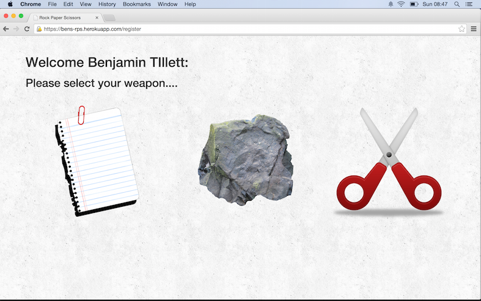

https://bens-rps.herokuapp.com/


FRIDAY CHALLENGE 5 Rock Paper Scissors
======================================

@ Makers Academy
----------------





An online rock paper scissors clone built on sinatra and hosted online via heroku and monitored with New Relic.

[Click here](https://bens-rps.herokuapp.com/) to check it out 

Skills learnt/used
-----------------
> * Ruby
> * Rspec
> * Sinatra
> * New Relic
> * Html5
> * CSS3


How to use
----------

Clone the repository:

```shell 
$ git clone git@github.com:benjamintillett/rockpaperscissors.git

```

run rspec to view the tests:

```shell 
$ rspec
```

Cd into the directory and rackup:

```shell 
$ cd rockpaperscissors
$ rackup
```

Point your browser to http://localhost:9292/ to play!.

